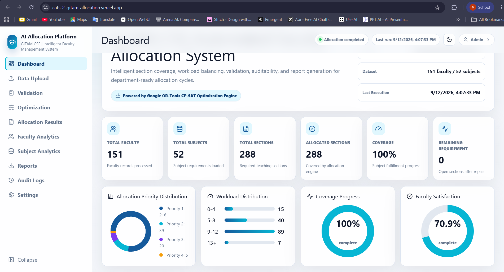
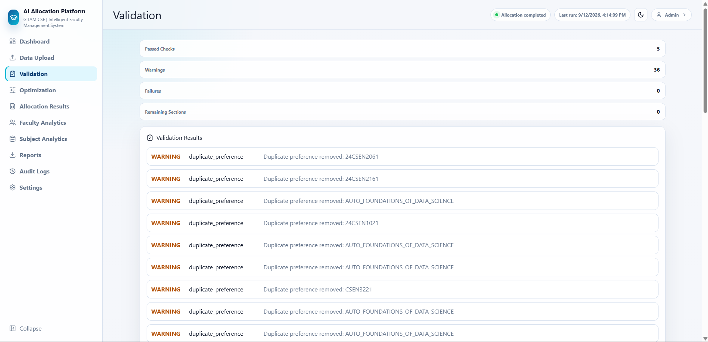
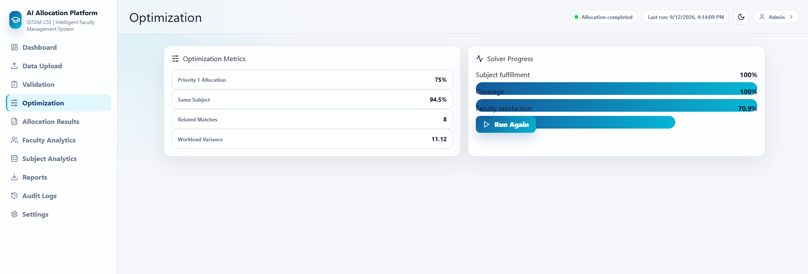
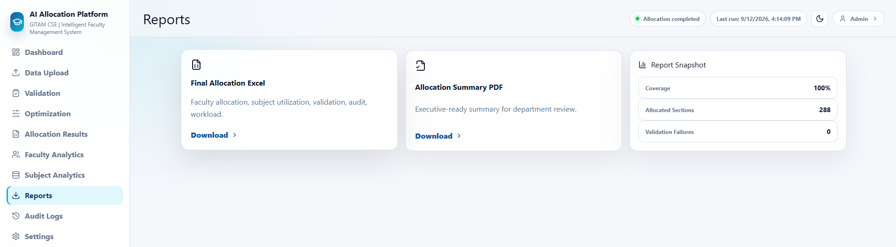

# GITAM CSE Automated Faculty Allocation System

AI Allocation Platform for semester-wise faculty subject allocation in the GITAM CSE department. The system processes faculty preference workbooks and subject requirement workbooks, validates messy academic data, runs a bottom-up allocation engine, repairs remaining coverage, and generates department-ready Excel and PDF reports.

**Live Demo:** [https://cats-2-gitam-allocation.vercel.app/](https://cats-2-gitam-allocation.vercel.app/)

**Backend:** [https://cats-2-gitam-allocation.onrender.com/](https://cats-2-gitam-allocation.onrender.com/)

**Backend Health:** [https://cats-2-gitam-allocation.onrender.com/health](https://cats-2-gitam-allocation.onrender.com/health)

**Repository:** [https://github.com/Arunrajdamera/cats-2-gitam-allocation](https://github.com/Arunrajdamera/cats-2-gitam-allocation)

## Overview

Faculty allocation in a large academic department is difficult because every subject has a required number of teaching sections, every faculty member has ranked preferences, and every designation has workload expectations. This project converts that manual spreadsheet-heavy process into a web application with upload, validation, allocation, analytics, admin review, audit logs, and report exports.

The application is intentionally practical: it accepts real Excel files, highlights warnings instead of hiding data quality problems, and keeps the final output understandable for department administrators.

## Problem Statement

The previous allocation workflow depended on manual coordination through forms and spreadsheets. That created recurring issues:

- Faculty preferences were difficult to compare consistently.
- Duplicate preferences and missing values required manual cleanup.
- Subject section coverage had to be checked repeatedly.
- Workload limits were easy to violate in manual Excel workflows.
- Report preparation took extra time after allocation.
- Manual changes were hard to audit.

## Solution

The system provides an end-to-end workflow:

1. Upload faculty preference and subject requirement Excel files.
2. Parse and normalize faculty, subject, priority, capacity, and workload data.
3. Validate inputs and show warnings/failures.
4. Allocate subjects using bottom-up processing and priority matching.
5. Prefer same-subject pairs when feasible.
6. Run coverage repair for remaining subject requirements.
7. Apply preference-improving local swaps.
8. Display dashboard, analytics, validation, audit logs, and results.
9. Export Excel and PDF reports.

## Key Features

- Faculty preference workbook upload.
- Subject requirement workbook upload.
- Combined workbook upload.
- Subject code extraction from mixed text.
- Duplicate faculty submission handling.
- Duplicate preference warning and removal.
- Duplicate subject policy: `reject` or `merge`.
- Bottom-up faculty allocation order.
- Priority-based subject matching.
- Same-subject allocation preference for two-slot assignments.
- Workload limit checks by designation.
- Remaining capacity tracking.
- Related subject matching using semester/category/name similarity.
- Coverage repair phase for unfilled subject sections.
- Preference-improving swap pass.
- Validation dashboard with `PASS`, `WARNING`, and `FAIL` states.
- Faculty analytics and explanation panel.
- Subject analytics from allocation results.
- Audit log view.
- Admin login and frontend session handling.
- Allocation lock/unlock UI.
- Manual override UI with conflict warnings.
- Excel report export.
- PDF summary export.
- Docker Compose setup for local development.

## System Architecture

```text
+----------------------+       +----------------------+
| React / Vite UI     | <---> | FastAPI Backend      |
| Dashboard + Admin   |       | Upload + Allocation  |
+----------------------+       +----------------------+
            |                              |
            |                              v
            |                  +----------------------+
            |                  | Python Core Modules  |
            |                  | Parser / Validator   |
            |                  | Allocator / Reports  |
            |                  +----------------------+
            |                              |
            v                              v
+----------------------+       +----------------------+
| Excel / PDF Reports  |       | PostgreSQL Schema    |
| Downloaded by Admin  |       | Docker Init Support  |
+----------------------+       +----------------------+
```

Detailed architecture documentation is available in [docs/architecture/SYSTEM_ARCHITECTURE.md](docs/architecture/SYSTEM_ARCHITECTURE.md).

## Data Flow

```text
Faculty Preference Excel
        +
Subject Requirement Excel
        |
        v
React Upload Interface
        |
        v
FastAPI Upload Endpoints
        |
        v
OpenPyXL / Pandas Processing
        |
        v
Validation Engine
        |
        v
Bottom-Up Allocation Engine
        |
        v
Coverage Repair + Swap Improvement
        |
        v
Results + Statistics + Audit Log
        |
        v
Dashboard + Analytics + Reports
```

## Allocation And Optimization Engine

The allocation engine is implemented in Python in `backend/app/core/allocator.py`.

Verified behavior:

- Processes faculty from the bottom of the Excel order upward.
- Builds a ranked preference list for each faculty member.
- Removes duplicate preference selections.
- Checks subject remaining capacity before allocation.
- Checks designation workload limits before allocation.
- Gives same-subject slot pairs when two sections are available and workload permits.
- Falls back to mixed preferred subjects only when same-subject pairing is not feasible.
- Runs a coverage repair phase after preference allocation.
- Uses related matching when exact preferences cannot cover a remaining subject.
- Runs local swap optimization when swapping two assignments improves preference scores without violating workload limits.
- Records audit events during allocation and swap operations.

Important implementation note: `ortools` is listed in backend dependencies for future solver work, but the inspected current allocation implementation is a deterministic Python heuristic with repair and swap optimization. It should not be described as a machine-learning model.

## Constraint Handling

The current code handles these constraints:

- Subject capacity cannot go below zero.
- Faculty workload must remain within configured designation limits.
- Regular faculty allocation slots are limited by configuration.
- Bottom-up order is preserved.
- Duplicate allocation slots are validated.
- Missing preferences are sent to manual allocation status.
- Remaining subject coverage is validated after repair.

Default workload limits:

| Designation | Maximum Workload |
| --- | ---: |
| Professor | 6 |
| Associate Professor | 10 |
| Assistant Professor | 14 |

## Validation And Auditability

Validation checks are generated by the parser and allocation engine. Examples include:

- Missing faculty name.
- Duplicate preference.
- Invalid subject selection.
- Missing preferences.
- Missing subject code.
- Invalid subject capacity.
- Duplicate subject code.
- Subject coverage.
- Capacity overflow.
- Workload limit.
- Duplicate slot.
- Bottom-up order.
- Coverage phase completion.
- Audit log integrity.

Audit events are generated for system allocation actions and preference-improving swaps. The frontend also tracks local admin events such as login, lock/unlock, manual override, and credential updates.

## Analytics

The dashboard and analytics pages display:

- Total faculty.
- Total subjects.
- Total sections.
- Allocated sections.
- Remaining sections.
- Coverage percentage.
- Priority distribution.
- Workload distribution.
- Faculty satisfaction.
- Faculty workload overview.
- Subject allocation summary.

## Reports

The backend exports:

- Excel allocation report through `GET /export/excel`.
- PDF summary report through `GET /export/pdf`.

The Excel workbook includes:

- Final Faculty Allocation.
- Subject Utilization.
- Manual Allocation Required.
- Coverage Allocations.
- Validation Report.
- Statistics.
- Audit Log.
- Manual Corrections.
- Workload Report.
- Priority Satisfaction.

## Technology Stack

| Layer | Technologies |
| --- | --- |
| Frontend | React, TypeScript, Vite, Tailwind CSS, AG Grid, Lucide React |
| Backend | Python, FastAPI, Pydantic, OpenPyXL, Pandas, ReportLab, Uvicorn |
| Database / Schema | PostgreSQL schema, SQLAlchemy dependency, Psycopg |
| Deployment | Docker, Docker Compose, Vercel frontend, Render backend |
| Testing | Python unittest, frontend TypeScript build, source verification script |

## Project Structure

```text
.
├── backend/
│   ├── app/
│   │   ├── api/
│   │   ├── core/
│   │   └── db/
│   ├── tests/
│   ├── Dockerfile
│   └── requirements.txt
├── frontend/
│   ├── src/
│   ├── Dockerfile
│   ├── package.json
│   └── vite.config.ts
├── docs/
│   ├── architecture/
│   ├── screenshots/
│   ├── API.md
│   └── DEPLOYMENT.md
├── sample_data/
├── scripts/
├── docker-compose.yml
├── .gitignore
└── README.md
```

## Application Screenshots

### Dashboard



### Data Upload


### Validation



### Optimization



### Faculty Analytics


### Reports



### Audit Logs


### Admin Panel


### Final Allocation Excel


## Installation

### Prerequisites

- Docker Desktop.
- Git.
- Modern browser.

Python, Node.js, and PostgreSQL do not need to be installed separately when using Docker.

### Clone

```powershell
git clone https://github.com/Arunrajdamera/cats-2-gitam-allocation.git
cd cats-2-gitam-allocation
```

### Run With Docker

```powershell
docker compose up --build
```

Frontend:

```text
http://localhost:5173
```

Backend API docs:

```text
http://localhost:8000/docs
```

Stop:

```powershell
Ctrl + C
docker compose down
```

## Environment Variables

Frontend:

| Variable | Purpose |
| --- | --- |
| `VITE_API_URL` | Public backend base URL used by the React app. |
| `VITE_ADMIN_USERNAME` | Optional frontend admin username override. |
| `VITE_ADMIN_PASSWORD` | Optional frontend admin password override. |

Backend:

| Variable | Purpose |
| --- | --- |
| `DATABASE_URL` | PostgreSQL connection URL used by deployment configuration. |

No `.env` file with secrets should be committed.

See [frontend/.env.example](frontend/.env.example) for the frontend variables used during deployment.

## Local Development

Backend:

```powershell
cd backend
pip install -r requirements.txt
$env:PYTHONPATH='.'
uvicorn app.api.main:app --reload --host 0.0.0.0 --port 8000
```

Frontend:

```powershell
cd frontend
npm install
npm run dev
```

## Production Deployment

Current deployment architecture:

- Frontend: Vercel.
- Backend: Render.
- Frontend URL: [https://cats-2-gitam-allocation.vercel.app/](https://cats-2-gitam-allocation.vercel.app/)
- Backend URL: [https://cats-2-gitam-allocation.onrender.com/](https://cats-2-gitam-allocation.onrender.com/)

Vercel configuration:

```text
Root Directory: frontend
Build Command: npm run build
Output Directory: dist
Environment Variable:
VITE_API_URL=https://cats-2-gitam-allocation.onrender.com
```

The frontend does not use `/api/*` relative routing. It calls the backend through `VITE_API_URL`.

Render backend start command:

```text
uvicorn app.api.main:app --host 0.0.0.0 --port $PORT
```

## API Overview

| Method | Endpoint | Purpose |
| --- | --- | --- |
| `GET` | `/health` | Backend health check. |
| `POST` | `/upload/faculty` | Upload faculty preference workbook. |
| `POST` | `/upload/subjects` | Upload subject requirement workbook. |
| `POST` | `/upload/combined` | Upload combined workbook. |
| `POST` | `/allocation/run` | Run allocation. |
| `GET` | `/results` | Get faculty allocation results. |
| `GET` | `/statistics` | Get dashboard metrics. |
| `GET` | `/validation` | Get validation checks. |
| `GET` | `/audit` | Get audit events for current run. |
| `POST` | `/override` | Queue admin override request. |
| `POST` | `/swap` | Queue faculty swap request. |
| `POST` | `/manual-correction` | Queue manual correction request. |
| `GET` | `/export/excel` | Download Excel report. |
| `GET` | `/export/pdf` | Download PDF summary. |

## Example Workflow

1. Open the live application or local frontend.
2. Upload faculty preference Excel file.
3. Upload subject requirement Excel file.
4. Select duplicate handling policy.
5. Run allocation.
6. Review dashboard KPIs.
7. Inspect validation warnings.
8. Review allocation results and analytics.
9. Download Excel/PDF reports.
10. Use Admin Panel for manual review if required.

## Results And Metrics

The checked sample run in `sample_data/verification_summary.json` reports:

| Metric | Value |
| --- | ---: |
| Faculty processed | 151 |
| Subjects processed | 52 |
| Total sections | 288 |
| Allocated sections | 288 |
| Remaining sections | 0 |
| Coverage | 100% |
| Priority 1 allocations | 216 |
| Priority 1 allocation percentage | 75% |
| Priority 1 faculty satisfaction | 70.86% |
| Same-subject percentage | 94.53% |
| Mixed-subject percentage | 5.47% |
| Related match allocations | 8 |
| Coverage allocations | 24 |
| Validation failures | 0 |
| Runtime | 0.064 seconds |

## Testing

Backend tests:

```powershell
$env:PYTHONPATH='backend'
python -m unittest discover backend/tests
```

Frontend build:

```powershell
cd frontend
npm run build
```

Source verification:

```powershell
$env:PYTHONPATH='backend'
python scripts/verify_sources.py --faculty "path\to\faculty.xlsx" --subjects "path\to\subjects.xlsx" --duplicate-policy merge
```

## Security Considerations

Current implementation notes:

- CORS is open in the FastAPI app for deployment simplicity.
- Admin authentication is frontend-side and suitable only for demonstration.
- Uploaded workbooks are stored in temporary directories while processing.
- Active allocation state is kept in FastAPI memory for the current runtime.
- PostgreSQL schema exists, but persistent allocation history is not fully wired into the current API.
- Do not commit `.env` files or production secrets.
- Use a managed secret store for production database credentials.

Recommended production hardening:

- Replace frontend-only admin auth with backend JWT or institutional SSO.
- Restrict CORS to the deployed frontend domain.
- Persist allocation runs, audit logs, and manual overrides in PostgreSQL.
- Add file type/size limits for uploads.
- Add CI checks for frontend build and backend tests.

## Future Enhancements

- Backend-persisted manual overrides.
- Full PostgreSQL-backed allocation history.
- Role-based access control.
- JWT or SSO authentication.
- Direct Google Sheets import.
- Dedicated subject utilization API for frontend analytics.
- Optional OR-Tools CP-SAT solver implementation.
- Email notifications for finalized allocations.
- Multi-semester historical analytics.
- CI/CD workflow for tests and deployment.

## Author

**DAMERA ARUNRAJ**

B.Tech Computer Science (Cyber Security)

GITAM School of Technology, GITAM University

GitHub: [https://github.com/Arunrajdamera](https://github.com/Arunrajdamera)

LinkedIn: [https://www.linkedin.com/in/arunrajdamera20/](https://www.linkedin.com/in/arunrajdamera20/)
